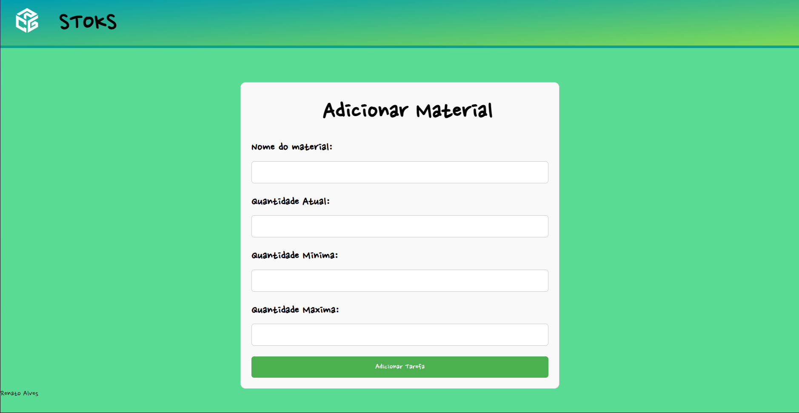

# STOKS 📦


https://stoks.onrender.com

## Tecnologias usadas:
- Handlebars
- CSS
- JavaScript
- Node.js
- Express.js
- IndexedDB API
- PostgreSQL
- DBeaver
- JSON Web Token (JWT)
- Render

## Sobre:
STOKS é um projeto de gerenciamento de estoque.

Fornece funcionalidades como:

- Inserir uma quantidade mínima e máxima para o estoque.  
  Assim, quando um determinado material atingir o estoque mínimo, o sistema avisará o usuário que é necessário fazer uma nova compra.  
  O estoque máximo serve como um limite para a quantidade daquele material.

- Utiliza a API IndexedDB para criar um estoque individual para cada usuário do STOKS.  
  Dessa forma, sempre que o usuário retornar ao site, seu estoque permanecerá exatamente como ele o deixou.

- Sistema de autenticação com funcionalidades de login e registro, integradas em um banco de dados da nuvem.

- Padrão JWT integrada no sistema, para trazer mais segurança para o projeto. 

## 🚀 Executando o Projeto

Siga as instruções abaixo para executar o projeto em seu ambiente local:

1. **Clone o repositório:**

   ```
   git clone https://github.com/devRenatoAlves/projeto-stok
   ```

2. **Navegue até o diretório do projeto:**

   ```
   cd projeto-stok
   ```

3. **Instale as dependências:**

   ```
   npm install
   ```

4. **Execute o servidor:**

   ```
   node src/app.js
   ```

5. **Acesse a aplicação:**

   Abra o seu navegador e digite o seguinte endereço:

   ```
   http://localhost:1000
   ```

   Agora você pode começar a utilizar a aplicação, criar, visualizar, atualizar e excluir tarefas.
